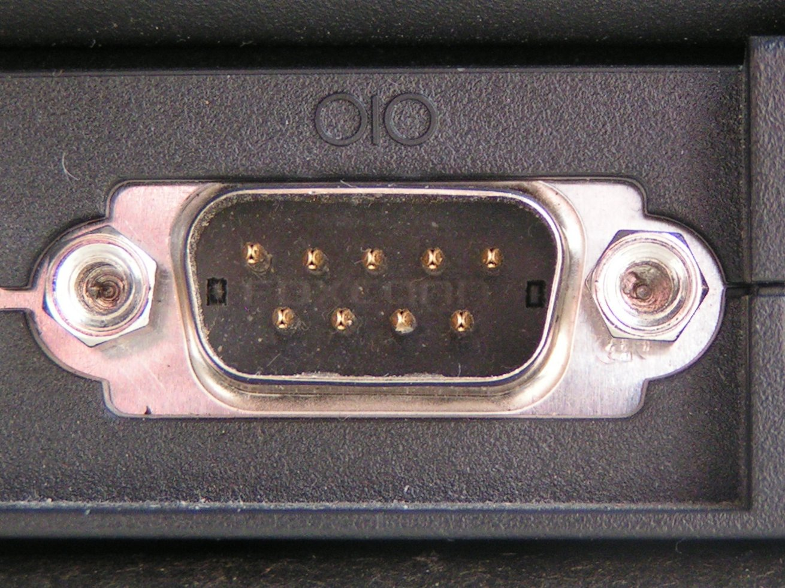

class: center, bottom, first-slide
background-image: url(leds.png)


# Creating Interactive Art with Open Source
## http://github.com/carrigan/interactive_art
### @bcarrigan

---
class: center, middle, small-image

## About Me


???

- So who am I and why am I talking about interactive art?
- Senior Backend and Systems Engineer at Smashing Boxes.
- Digital Product Agency here in Downtown Durham.
- I'm also the technical head of Fraqture, our open source art platform

---
class: middle, full-image


???

- Does anyone know what this is?
- Assembly code: great puzzle (there are actually assembly games now)
- Bad for quickly solving problems
- Story with my interaction with Open Source starts in college
- Had to thumb through 1000 page manuals just to boot
- Took forever just to blink an LED

---
class: full-image


???

- Conducting robots class: students from 5 different schools making a robot for a 10 piece orchestra.
- Using these tools, we were able to build a robot in one semester
  - Use any MIDI file as input
  - Conduct a 10 piece orchestra
  - Arms + Wrist -> Intensity
  - LEDs -> Queueing instruments + tempo

- The professors had encouraged us to use fantastic open source tools for this: Arduino and Processing.
- These tools changed my perception about what good software environments and interfaces look like,
  and showed how a community could build something that allows makers to immediately jump into
  the high value parts of what they are looking to build.

- For the rest of this talk, we'll:
  - Start with a brief overview of what frameworks are available and how they work.
  - Talk about building a small project from concept to completion
  - Finish with tips for larger projects

---
class: big-points

## Stateful Animation

- Setup: Create a function that will be called once when the program starts, initializing state.
- Loop: Create a function that will be called X times per second, outputting something based on state.

???


- There are tons of ways to think about animation, but all of the frameworks we'll be working with
  follow a simple pattern; setup and loop.
- The way to reason about that is as follows
- Phrase this ambiguously since for hardware we aren't drawing so much as manipulating LEDs, motors,
  etc

---
class: small-image


???

- So for a simple example, lets talk about a circle moving across the screen right, then looping
  around.
- In your setup, you would initialize where the circle starts, set your frame rate.
- Then in your draw function, you could update the state of your circle to be a bit farther right
- Finally, you could draw the circle to the screen.

---

## Processing

- Java based animation program with its own interface.

```java
void setup() {
  frameRate(30);
}

int x = 0;
void draw() {
  circle(x, height() / 2, 50, 50);
  x = (x + 1) % width();
}
```

???

- Runs on top of Java, has a neat little interface so you never need to use the command line.
- Sets up a desktop canvas app and lets you draw on that canvas.
- Abstractions for drawing shapes, text, etc.
- Simple framework, but a very powerful way to think about animation
- Latest version includes sound

---

## p5.js

- Processing for Javascript

```javascript
var x;
function setup() {
  x = 0;
}

function draw() {
  x = x + 1;
  if (x > width()) {
    x = 0;
  }

  circle(x, height() / 2, 50, 50);
}
```

???

- p5 has the same interface and most of the same functions as Processing, but runs on Javascript.
- Low barrier of entry for JS developers, and allows it to be embedded in pages easily.

---

# name: p5demo

???

Remove the comment to make this playable.

---

## Quil

- Clojure binding to Processing

```clojure
(defn setup []
  (q/frame-rate 30) 0)

(defn update [x]
  (rem (+ x 1) (q/width)))

(defn draw [x]
  (q/circle x (/ (q/height) 2) 50 50))
```

???

- Years later I became really interested in Clojure, and started looking for Clojure binding for
  Processing
- Sam Aaron (Overtone, Quil, SonicPi)
- Bret Victor's talk, "Inventing on Principle" - https://www.youtube.com/watch?v=PUv66718DII
- Best of all worlds:
  - Coupled with Overtone for music
  - Compiles to Clojurescript


---
class: center, middle

## Capabilities Grid

|            | Hardware | Keyboard | Embeddable | Sound | REPL |
|------------|----------|----------|------------|-------|------|
| p5         | N        | Y        | Y          | Y     | N    |
| Processing | Y        | Y        | *          | Y     | N    |
| Quil       | Y        | Y        | Y          | *     | Y    |

---
class: full-image

## Microcontrollers


???

- Processing -> Graphics, Arduino -> Hardware
- Purpose: write programs that use signals from sensors to do something.
- It was really frustrating to read through 1000 page datasheets just to blink an LED
- Why not use a raspberry pi or computer?
  - Very low power chip - can be battery powered.
  - Simple - no OS, very low resources; you just write a loop that runs forever and thats your
    program.
  - These chips will not be running anything more than Rust, C, C++ but that is fine: your microwave
    doesn't need to be able to run NPM.

---

## Arduino

- Provides chip setup, a simple analog and digital API, and a two function interface.

```cpp
int ledPin = 5;
void setup() {
  pinSetup(ledPin, OUTPUT);
}

void loop() {
  static bool on = false;
  digitalWrite(ledPin, on ? HIGH : LOW)
  on = ~on;
  delay(500);
}
```
---
class: center, middle

# Building a Small Project

???

- How to structure your Quil project so it is hot-reloadable
- Mocking your hardware before ever touching an Arduino
- A simple example of a talking to a computer

---
class: full-image, middle, center


Photo: https://www.youtube.com/

???

What Is It
- Slowly reading Godel, Escher, Bach, which inspired me to make a piece of recursive art
- Drawing would draw itself with a window, then pass that windowed view to the next drawing.
- Anyone who has watched Modern Family will know the concept from their intro.

---
class: full-image

## Modern Art Generator


???

- Here are some early sketches

---

## Hot Reload

- Processing/Quil use something called a `sketch` as an interface to define where and how to draw
your image.
- To enable hot reloading, split your draw functions into a separate namespace and use:

```clojure
(use 'namespace.reloadable-functions :reload)
```

???

- Go to demo.

---
class: full-image

## Mock it 'til you Make It


???

- So first thing you want to do with a project like this is to define what your user interface
  will be. In my case, I wanted a couple of dials like an analog synth but to control my drawing.
- Color has a range; typically we break it into RGB or HSL and then range those by 0-255.
- Want an event to allow us to move into the next layer; the perfect event is a button press.
- There are two big reasons that you will want to mock your interface before building the Arduino
  version:
  1. If you want to work with other people on this, it is safe to assume that not everyone will keep
     the most recent copy of the hardware.
  2. Hardware costs money and adds time to development with shipping and building times. It would be
     nice to see if the interface you designed is really the compelling experience you thought before
     sinking these costs.

---
class: full-image


???

- Dials are just ways to adjust some value between its max and min. A good linear analogue is the
  slider.
- Buttons are just a simple event. We can use keypresses or an actual button element that you can
  click on.
- Add code where you attempt to connect to serial, and if not found, use the mock instead.

---
class: full-image

##... but eventually make it


???

- Define
  - Potentiometer - limited range, analog signal between all on or all off
  - Button - binary on or off
  - Rotary Encoder - like a potentiometer, but unlimited range. Sends events instead of a signal.
  - Think of a car radio

---
class: full-image, middle


---
class: small-image

# Making Things Talk



Photo: https://www.wikipedia.org/

???

- Serial is one of the oldest interfaces for computers. It provides an asynchronous data stream
  in both directions at a hard coded bit rate.
- 115200bps, 14.4kB/s. Anything more needs ethernet.
- Not packetized; every character triggers a receive event.
- Perfect for this: no overhead or assumptions about what your packets look like; you can make up
  everything.

---
class: small-image

## Simple Example

- If you message can fit in one character, use a single character to trigger things.


???

- Twitter on steroids

---
class: full-image

## Multiple Bytes

- Multiple bytes presents a problem: Framing.
- Easy solution: Make `255` a frame delimiter.


???

- Think about it this way: imagine a person who is measuring a bunch of things and just saying
  the numbers out loud in a certain order: 5 31 19 106   5 31 19 106
- If you enter the room in the middle of one of these, you could hear 19 106 5 31  19 106 5 31
- What we need is a PERIOD - something to say when one message is finished and another one starting

---

## Multiple Bytes

```cpp
int potentiometerReading(int pin) {
  int reading = analogRead(pin);
  reading = reading / 4;

  if(reading == 255)
    return 254;

  return reading;
}
```

---
class: center, middle, small-image

## Serial in Clojure


???

- I think that the code for the Clojure side is a little verbose for this talk, but you can go to
  the repo to check it out.
- The important thing that I will note is that serial ports are handled in another thread, so the
  basic jist is to open up a serial port in a thread, and have it pump data into a queue of some
  sort to be parsed during the update function.
- And then in your update function, you can parse that buffer into a state.

---

class: full-image, middle


???

Scrap Exchange - $3 worth of wood

---
class: full-image, middle


---
class: tiny-image, middle


---
class: center, middle

## Demo

---
class: full-image

# Scaling Up


???

- Storefront Project
- Saw an awesome way to bridge the communities

---

class: small-image, middle


???

- Loose associations
  - Glitch art
  - Digital Billboards

---

class: full-image, middle


???

- What would the installation look like?
  - Cubicle story.
  - High fidelity screen with a low fidelity extension to the canvas

---
class: small-image

## Hardware

- Teensy 3.2
- 540 Dotstar LEDs (18m @ 30/m)


???

- Much different challenges: power distribution and updating the LEDs in a decent amount of time.
- 540 LEDs use 30W of power - cheapest power supply is actually a computer power supply.

---
class: small-image
## LEDs

- LEDs are a long serial string that require 4 bytes each.
- Hitting 20 FPS would be over 40,000 bytes/s


???

- `(* 540 4) -> 2160 bytes`

---

## Frame Buffer

- Interface for setting individual LEDs or drawing boxes of color.

```clojure
(paint-window port x1 y1 x2 y2 [r g b])
```

- Once the frame is complete, a refresh command paints the physical LEDs.

```clojure
(refresh port)
```

---
class: full-image

## Mock


???

- LEDs alone cost nearly $400, a lot of time to build, and we wanted to be able to work on it while
  it was on display and also allow others to contribute without the
- Remade the entire interface in Clojure: when the API calls are made, instead of going out over
  serial, they update an internal frame buffer that is painted.
- When you run it you can just include --mock and it will draw the mock on top of everything else.

---

## Drawing Cycle

- Added several functions to the setup/draw/update function.
  - `exit`
  - `cli`
  - `acts-on`

???

Allows us to run them individually or to cycle through the pictures.

---
class: tiny-image

## Interactivity: Twitter

- Bot written in Ruby that pulled down anything our account retweeted.
- Keep track of which ones were displayed so new ones were instant.


???

- The last thing I want to talk about is how we achieved interactivity behind glass.

---

## Interactivity: Camera

- Used a webcam and a command line app called `imagesnap`.
- Keep track of which ones were displayed so new ones were instant.
- After being displayed once, they were copied to an archive.

```clojure
(defn take-picture [holdoff]
  (let [now (System/currentTimeMillis)]
    (shell/sh "imagesnap" "-w" (str holdoff)
      (str "rasters/once_" now ".jpg"))))
```

???

- Don't reinvent the wheel! Use off the shelf products if you can.

---
class: full-image, middle


---

## Conclusion

- Open source tools simplify getting a canvas or hardware project up and running.
- Mocks help test your theories before building anything.
- Hardware allows for all sorts of interfaces.
- Making art is fun and rewarding.

---
class: middle, center

# Thank You
## http://github.com/carrigan/interactive_art
### @bcarrigan

???

- Again, this is all online at the link here

---

# Resources

- [Quil API](http://quil.info/api)
- [Arduino](https://www.arduino.cc/)
- [Sparkfun](https://www.sparkfun.com/)
- [Adafruit](https://www.adafruit.com/)
