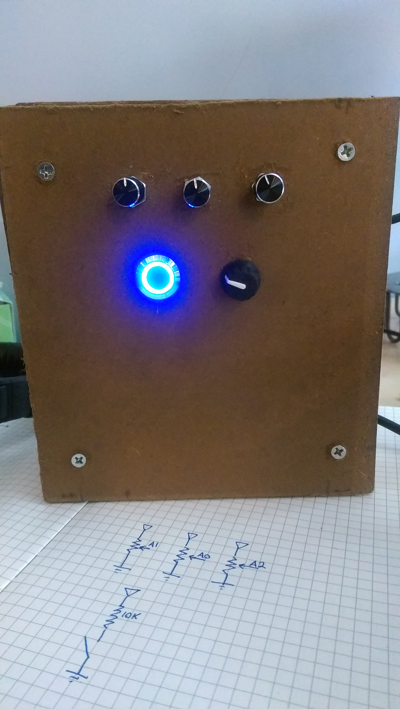

# Interactive Art

This project contains the slides and code for my talks about how to create
Interactive Art given at the TriClojure meetup in September 2016 as well as All
Things Open 2016. The TriClojure one is more technical and Clojure focused; if
you are just starting out I would suggest the ato2016 folder. Both of these
talks go through the frameworks available for building interactive art, walk
through a small project, and then talk about how to scale up to something larger
like [Fraqture](http://www.fraqture.com).

## How to View

The slide decks are written in Markdown, and can either be viewed directly in
Github as a document or using the Remark javascript framework. To do the latter,
you can clone this repo and run `python -m SimpleHTTPServer` in the `ato2016` or
`triclojure` directories to host a local copy of the slides.
