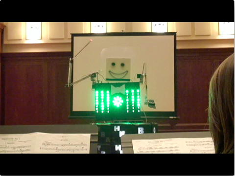
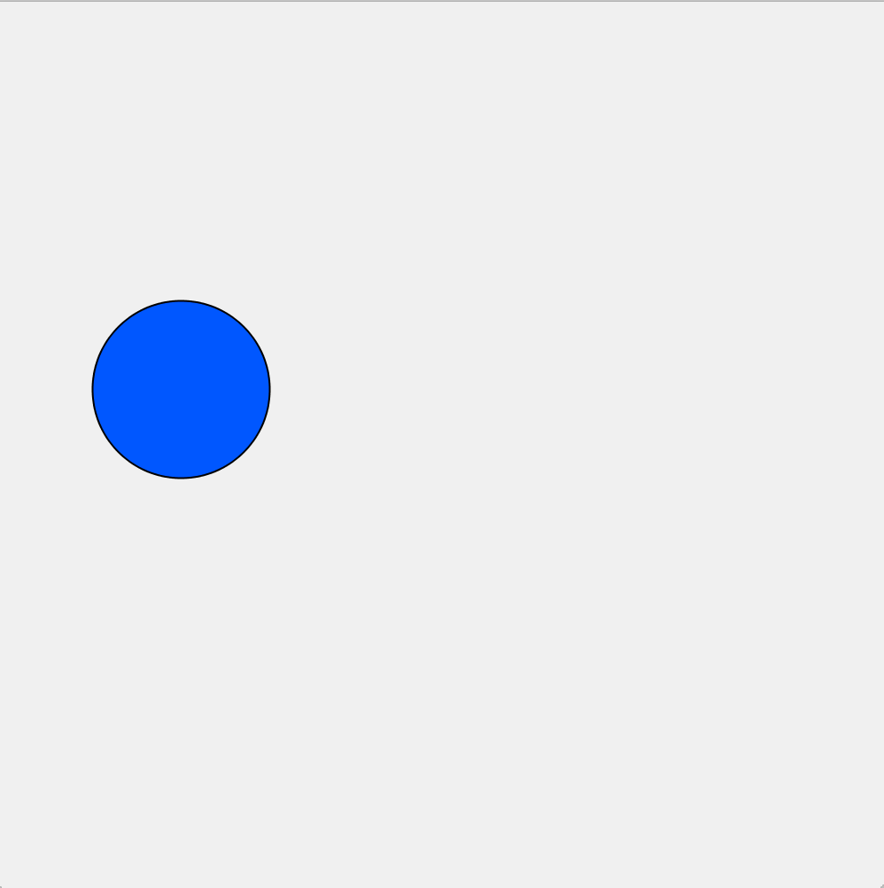
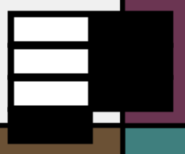
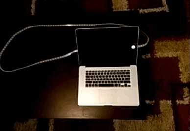
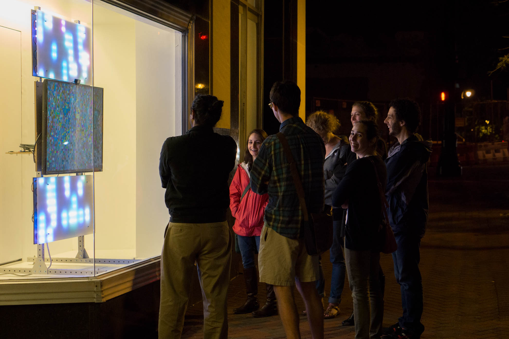
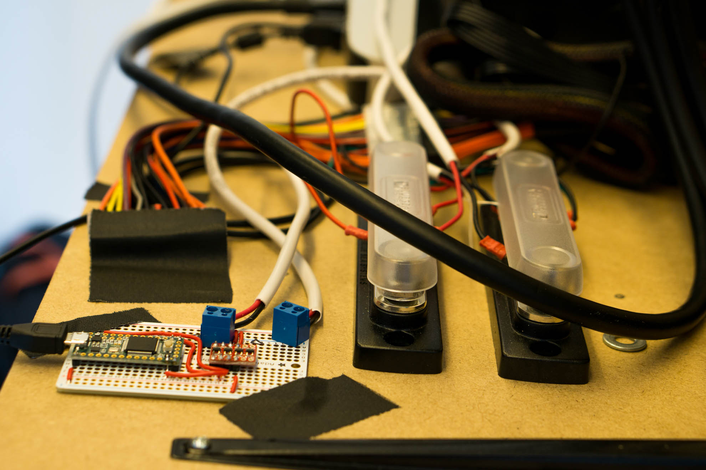
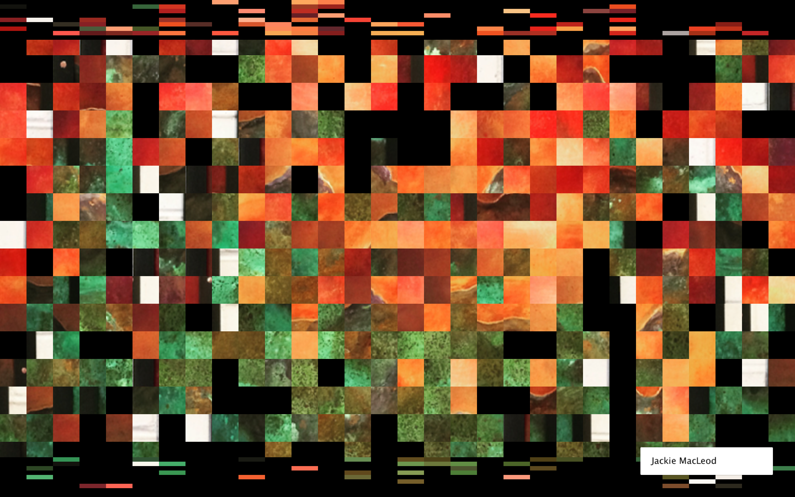

# Making Interactive Art With Quil and Arduino
## http://github.com/carrigan/interactive_art

---

## About Me

???

- So who am I and why am I talking about interactive art?
- Senior Backend and Systems Engineer here at SB.
- The Systems part means that I used to be an Embedded Engineer, so I'm very comfortable designing
  circuits and coding in C for really, really small computers.

---

## Fraqture


???

- I'm also the maintainer of Fraqture, our open source art platform written using Clojure's Quil
  library paired with Arduino.
- Fraqture was conceived of for the Durham Storefront Project which helps empty windows in downtown
  Durham find art to be displayed in them. We pitched them the idea of a digital billboard that
  would take content and glitch it.
- We'll come back to this later after we learn a bit about the underlying frameworks.

---

< Image of a microcontroller >

???

- We're going to be talking about these tiny computers a lot so I'll take a second to talk about them.
  They are called microcontrollers and they are made to run programs that read electrical signals
  from sensors and do something with them, like turn on LEDs, control motors, or talk to other computers.
- The one pictured here is an ATMega328 - the original chip used for Arduinos. It is an 8 bit processor,
  which means that its math operations can only run on 8 bit numbers. If you need to multiple two
  32 bit integers, it can take several hundred clock cycles to do so. Forget float math at the door.
- This chip has only 32kB of program storage and 2kB of RAM. This is not enough for an operating
  system, so what you typically do is use your computer to compile a program for it, and then you
  load that program on the chip and when it boots up, that program is the only thing it knows how
  to do.
- If this sounds intimidating, it used to be and it still is in a lot of cases. When I was in college
  we were taught to use Assembly to program them and you had to write hundreds of lines of code
  just to initialize the chip properly and then many more to write your program. Even if we got to
  use C, it was really frustrating to read through 1000 page datasheets just to blink an LED.

---



???

- This all changed though when I took a class outside the engineering school where we had a group
  of students from 5 different schools that were tasked with making a robot that could conduct a
  10 piece orchestra. The professors had encouraged use to use two tools for this: Arduino and
  Processing. I didn't know it at the time but learning these tools would change the course of my
  career.
- Using these tools, we were able to build a robot in one semester that would take a MIDI file as
  input and use it to conduct any song to a 10 piece orchestra. Our robot had motors controlling one
  arm to conduct in the traditional manor, motors controlling the other arm and wrist to show what
  intensity the song was at, and LEDs that were used for letting instruments know that they are
  coming up as well as to show the 4/4 beat visually.
- For the rest of this talk, we'll be going over how these frameworks help making interactive digital
  art, talking about how to scale from a file drawing to a having hardware and software working
  together to make some awesome things, and finish with a slew of links for anyone interested in
  building some of this stuff.

---

## Processing

- Provides a canvas, drawing primitives, and a two function interface.

```java
void setup() {
  frameRate(30);
}

int x = 0;
void draw() {
  circle(x, height() / 2, 50, 50);
  x = (x + 1) % width();
}
```

---



---

## Quil

```clojure
(defn setup []
  (q/frame-rate 30))

(defn update [x]
  (rem (+ x 1) (q/width)))

(defn draw [x]
  (q/circle x (/ (q/height) 2) 50 50))
```

???

- Fast forward many years and I met TriClojure's own Michael Stalker and we did a SICP study group
  where I learned how awesome lisps can be.
- It had been a while since I had played with Processing so I decided to see if there was a Clojure
  binding for Processing and found Quil. I made a small drawing for the first time and opened it
  in a REPL and was hooked; using Clojure you could actually hot reload the drawing code and turn
  circles to squares and move things around without restarting anything.
- Since data is immutable in Clojure, Quil has a 3 function interface where instead of modifying and
  drawing things in your draw loop, you have an `update` function where you modify your state and
  then your `draw` function is simply a renderer.
- Anyone familiar with React, Reagent, Om, etc. may recognize this pattern; your update function is
  essentially your reducer and when it completes, the draw function is essentially your views.s
- Speaking of these frameworks: this can also compile to clojurescript and be used on the web.

---

## Arduino

- Provides chip setup, a simple analog and digital API, and a two function interface.

```cpp
int pinNo = 5;
void setup() {
  pinSetup(pinNo, OUTPUT);
}

void loop() {
  static bool on = false;
  digitalWrite(pinNo, on ? HIGH : LOW)
  bool = ~bool;
  delay(500);
}
```

---

# Building a Small Project

< picture of project >

???

- How to structure your Quil project so it is hot-reloadable
- Mocking your hardware before ever touching an Arduino
- A simple example of a talking to a computer

---

## Hot Reload

- Processing/Quil use something called a `sketch` as an interface to define where and how to draw
your image.
- To enable hot reloading, split your draw functions into a separate namespace and use:

```clojure
(use 'namespace.reloadable-functions :reload)
```

---

```clojure
(q/defsketch modern-art
  :title "Synthestesia"
  :size [800 800]
  :setup dynamic/setup
  :update dynamic/update-state
  :draw dynamic/draw-state
  :mouse-pressed dynamic/mouse-pressed
  :features [:keep-on-top]
  :middleware [m/fun-mode])
```

???

- Go to demo.

---

## Mock it 'til you Make It

< Sketch of the dials and button >

???

- So first thing you want to do with a project like this is to define what your user interface
  will be. In my case, I wanted a couple of dials like an analog synth but to control my drawing.
- There are two big reasons that you will want to mock your interface before building the Arduino
  version:
  1. If you want to work with other people on this, it is safe to assume that not everyone will keep
     the most recent copy of the hardware.
  2. Hardware costs money and adds time to development with shipping and building times. It would be
     nice to see if the interface you designed is really the compelling experience you thought before
     sinking these costs.

---



???

- Dials are just ways to adjust some value between its max and min. A good linear analogue is the
  slider.
- Buttons are just a simple event. We can use keypresses or an actual button element that you can
  click on.
- Add code where you attempt to connect to serial, and if not found, use the mock instead.

---

##... but eventually make it

< Hardware picture >

---

< Schematic >

---

# Making Things Talk

< Picture of DB9 connector >

???

- Serial is one of the oldest interfaces for computers. It provides an asynchronous data stream
  in both directions at a hard coded bit rate.
- 115200bps, 14.4kB/s. Anything more needs ethernet.

---

## Where your logic lies

```
The serial line is somewhat like a web API; you define a contract for the two parties to speak over
and then build an application around that.
```

???

- Perfect for this: no overhead or assumptions about what your packets look like; you can make up
  everything.

---

## Simple Example

- If you have some simple events to send either way, you can use a single character to trigger things.



---

## Multiple Bytes

- Multiple bytes presents a problem: Framing.
- Easy solution: Make `255` a frame delimiter.
- Flexible solution: Length + Payload + Checksum

---

```cpp
int potentiometerReading(int pin) {
  int reading = analogRead(pin);
  reading = reading >> 2;

  if(reading == 255)
    return 254;

  return reading;
}
```

---

## Serial in Clojure

- Serial receive happens asynchronously and in another thread.
- Create an atom that receives the data and then parse it into program state during `update`.

---

```clojure
(defn update-serial
  [state]
  (let [received-atom (:received-atom state)
        message       @received-atom]
    (if (>= (count message) 5)
      (do
        (reset! received-atom [])
        (assoc state :state (build-state message)))
      (assoc-in state [:state :next-button] false))))
```

---

## Demo

---

# Scaling Up



???

- Talk about what Fraqture was designed for and what it does.

---

## Hardware

- Teensy 3.2
- 540 Dotstar LEDs (18m @ 30/m)
- Computer Power Supply



???

- Much different challenges: power distribution and updating the LEDs in a decent amount of time.
- 540 LEDs use 30W of power - cheapest power supply is actually a computer power supply.

---

## LEDs

- LEDs are a long serial string that require 4 bytes each.
- `(* 540 4) -> 2160 bytes`
- Hitting 20 FPS would be over 40,000 bytes/s

---

## Frame Buffer

- Interface for setting individual LEDs or drawing boxes of color.

```clojure
(paint-window port x1 y1 x2 y2 [r g b])
```

- Once the frame is complete, a refresh command paints the physical LEDs.

```clojure
(refresh port)
```

---

## Mock



???

- LEDs alone cost nearly $400, a lot of time to build, and we wanted to be able to work on it while
  it was on display and also allow others to contribute without the
- Remade the entire interface in Clojure: when the API calls are made, instead of going out over
  serial, they update an internal frame buffer that is painted.

---

```clojure
(defn curried-draw [drawing-atom with-mock? serial]
  (if with-mock?
    (fn [state]
      (do
        ((:draw @drawing-atom) state)
        (led/draw-mock serial)
        (attribution-overlay (:attributable state))))
    (fn [state]
      (do
        ((:draw @drawing-atom) state)
        (attribution-overlay (:attributable state))))))
```

---

## Drawing Cycle

- Added several functions to the setup/draw/update function.
  - `exit`
  - `cli`
  - `acts-on`

???

Allows us to run them individually or to cycle through the pictures.

---

## Interactivity: Twitter

- Bot written in Ruby that pulled down anything our account retweeted.
- Keep track of which ones were displayed so new ones were instant.

???


- The last thing I want to talk about is how we achieved interactivity behind glass.

---


---

## Interactivity: Camera

- Used a webcam and a command line app called `imagesnap`.
- Keep track of which ones were displayed so new ones were instant.
- After being displayed once, they were copied to an archive.

```clojure
(defn take-picture [holdoff]
  (let [now (System/currentTimeMillis)]
    (shell/sh "imagesnap" "-w" (str holdoff)
      (str "rasters/once_" now ".jpg"))))
```

---

## Thank You
