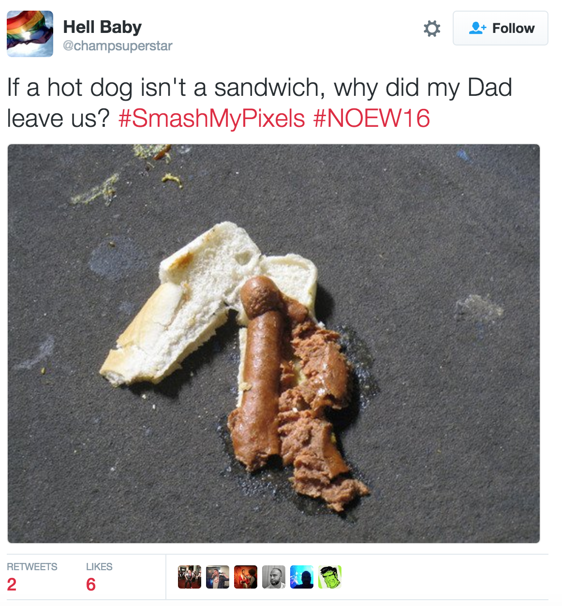

class: center, middle

# Making Interactive Art With Quil and Arduino
## http://github.com/carrigan/interactive_art
### @bcarrigan

---
class: center, middle

## About Me

???

- So who am I and why am I talking about interactive art?
- Senior Backend and Systems Engineer here at SB.
- The Systems part means that I used to be an Embedded Engineer, so I'm very comfortable designing
  circuits and coding in C for really, really small computers.

---
class: full-image

## Fraqture


???

- I'm also the maintainer of Fraqture, our open source art platform written using Clojure's Quil
  library paired with Arduino.
- Fraqture was conceived of for the Durham Storefront Project which helps empty windows in downtown
  Durham find art to be displayed in them. We pitched them the idea of a digital billboard that
  would take content and glitch it.
- We'll come back to this later after we learn a bit about the underlying frameworks.

---
class: full-image


???

- Story starts in college
- Conducting robots class: students from 5 different schools making a robot for a 10 piece orchestra.
- The professors had encouraged use to use two tools for this: Arduino and Processing.
- Using these tools, we were able to build a robot in one semester
  - Use any MIDI file as input
  - Conduct a 10 piece orchestra
  - Arms + Wrist -> Intensity
  - LEDs -> Queueing instruments + tempo
- For the rest of this talk, we'll:
  - Talk about these frameworks
  - Talk about building a project from a drawing to completion
  - Finish with tips for larger projects

---

## Processing

- Provides a canvas, drawing primitives, and a two function interface.

```java
void setup() {
  frameRate(30);
}

int x = 0;
void draw() {
  circle(x, height() / 2, 50, 50);
  x = (x + 1) % width();
}
```

???

- Sets up a graphical environment
- Abstractions for OpenGL to make it easier
- Push and Pop

---
class: small-image


---

## Quil

```clojure
(defn setup []
  (q/frame-rate 30) 0)

(defn update [x]
  (rem (+ x 1) (q/width)))

(defn draw [x]
  (q/circle x (/ (q/height) 2) 50 50))
```

???

- Fast forward many years and I met TriClojure's own Michael Stalker and we did a SICP study group
  where I learned how awesome lisps can be.
- Looked for Clojure binding for Processing and found Quil.
- Sam Aaron (Overtone, Quil, SonicPi)
- I made a small drawing for the first time and opened it in a REPL and was hooked
- Hot Reloading - change everything
- 3 function interface differences
- Anyone familiar with React, Reagent, Om, etc. may recognize this pattern; your update function is
  essentially your reducer and when it completes, the draw function is essentially your views.s
- Speaking of these frameworks: this can also compile to clojurescript and be used on the web.

---
class: full-image

## Microcontrollers


???

- Processing -> Graphics, Arduino -> Hardware
- It was really frustrating to read through 1000 page datasheets just to blink an LED
- Purpose: write programs that use signals from sensors to do something.
- Couple interesting differences from computers
  - Very low power chip.
  - It is an 8 bit processor
  - This chip has only 32kB of program storage and 2kB of RAM. No OS
  - This is fine: microwave doesn't need to be able to run NPM.

---

## Arduino

- Provides chip setup, a simple analog and digital API, and a two function interface.

```cpp
int pinNo = 5;
void setup() {
  pinSetup(pinNo, OUTPUT);
}

void loop() {
  static bool on = false;
  digitalWrite(pinNo, on ? HIGH : LOW)
  bool = ~bool;
  delay(500);
}
```

---
class: center, middle

# Building a Small Project


???

- How to structure your Quil project so it is hot-reloadable
- Mocking your hardware before ever touching an Arduino
- A simple example of a talking to a computer

---
class: full-image

## Modern Art Generator


???

What Is It
- Slowly reading Godel, Escher, Bach, which inspired me to make a piece of recursive art
- Drawing would draw itself with a window, then pass that windowed view to the next drawing.
- Pictures of a family holding a frame with the picture of the family in it.

---

## Hot Reload

- Processing/Quil use something called a `sketch` as an interface to define where and how to draw
your image.
- To enable hot reloading, split your draw functions into a separate namespace and use:

```clojure
(use 'namespace.reloadable-functions :reload)
```

---
## Hot Reload

```clojure
(q/defsketch modern-art
  :title "Synthestesia"
  :size [800 800]
  :setup dynamic/setup
  :update dynamic/update-state
  :draw dynamic/draw-state
  :mouse-pressed dynamic/mouse-pressed
  :features [:keep-on-top]
  :middleware [m/fun-mode])
```

???

- Go to demo.

---

## Code The MVP

```clojure
(defn recurse-frame [colors [cx cy mx my] [x y]]
  (when-not (empty? colors)
    (let [size-x (- mx cx)
          size-y (- my cy)]
      (q/push-matrix)
      (q/translate cx cy)
      (q/scale (/ size-x x) (/ size-y y))
      (let [next-location (-> colors (first) (frame/render))]
        (recurse-frame (rest colors) next-location [x y])
        (q/pop-matrix)))))
```

---
class: full-image

## Mock it 'til you Make It


???

- So first thing you want to do with a project like this is to define what your user interface
  will be. In my case, I wanted a couple of dials like an analog synth but to control my drawing.
- There are two big reasons that you will want to mock your interface before building the Arduino
  version:
  1. If you want to work with other people on this, it is safe to assume that not everyone will keep
     the most recent copy of the hardware.
  2. Hardware costs money and adds time to development with shipping and building times. It would be
     nice to see if the interface you designed is really the compelling experience you thought before
     sinking these costs.

---
class: full-image


???

- Dials are just ways to adjust some value between its max and min. A good linear analogue is the
  slider.
- Buttons are just a simple event. We can use keypresses or an actual button element that you can
  click on.
- Add code where you attempt to connect to serial, and if not found, use the mock instead.

---
class: full-image

##... but eventually make it


???

- Define
  - Potentiometer - limited range, analog signal between all on or all off
  - Button - binary on or off
  - Encoder - like a potentiometer, but unlimited range. Sends events instead of a signal.

---
class: full-image, middle


---
class: small-image

# Making Things Talk


???

- Serial is one of the oldest interfaces for computers. It provides an asynchronous data stream
  in both directions at a hard coded bit rate.
- 115200bps, 14.4kB/s. Anything more needs ethernet.

---
class: middle

## Making Things Talk

```
The serial line is somewhat like a web API;
you define a contract for the two parties to
speak over and then build an application
around that.
```

???

- Perfect for this: no overhead or assumptions about what your packets look like; you can make up
  everything.

---
class: small-image

## Simple Example

- If you have some simple events to send either way, you can use a single character to trigger things.


---
class: full-image

## Multiple Bytes

- Multiple bytes presents a problem: Framing.
- Easy solution: Make `255` a frame delimiter.
- Flexible solution: Length + Payload + Checksum


---

## Multiple Bytes

```cpp
int potentiometerReading(int pin) {
  int reading = analogRead(pin);
  reading = reading >> 2;

  if(reading == 255)
    return 254;

  return reading;
}
```

---
## Serial in Clojure

```clojure
(defn on-receive-gen
  [received-atom]
  (fn [stream]
    (let [character (.read stream)]
      (if (= character 255)
        (reset! received-atom [])
        (swap! received-atom conj character)))))
```

???

- A function that is called on every receive.
- Serial receive happens asynchronously and in another thread.
- Create an atom that receives the data and stuffs a buffer in it

---
## Serial in Clojure

```clojure
(defn update-serial
  [state]
  (let [received-atom (:received-atom state)
        message       @received-atom]
    (if (>= (count message) 5)
      (do
        (reset! received-atom [])
        (assoc state :state (build-state message)))
      (assoc-in state [:state :next-button] false))))
```

???

- And then in your update function, you can parse that buffer into a state.

---

class: full-image, middle


???

Scrap Exchange - $3 worth of wood

---
class: full-image, middle


---
class: tiny-image, middle


---
class: center, middle

## Demo

---
class: full-image

# Scaling Up


???

---

class: small-image, middle


---

class: full-image, middle


---
class: small-image

## Hardware

- Teensy 3.2
- 540 Dotstar LEDs (18m @ 30/m)
- Computer Power Supply


???

- Much different challenges: power distribution and updating the LEDs in a decent amount of time.
- 540 LEDs use 30W of power - cheapest power supply is actually a computer power supply.

---
class: small-image
## LEDs

- LEDs are a long serial string that require 4 bytes each.
- `(* 540 4) -> 2160 bytes`
- Hitting 20 FPS would be over 40,000 bytes/s


---

## Frame Buffer

- Interface for setting individual LEDs or drawing boxes of color.

```clojure
(paint-window port x1 y1 x2 y2 [r g b])
```

- Once the frame is complete, a refresh command paints the physical LEDs.

```clojure
(refresh port)
```

---
class: full-image

## Mock


???

- LEDs alone cost nearly $400, a lot of time to build, and we wanted to be able to work on it while
  it was on display and also allow others to contribute without the
- Remade the entire interface in Clojure: when the API calls are made, instead of going out over
  serial, they update an internal frame buffer that is painted.

---
## Mock

```clojure
(defn curried-draw [drawing-atom with-mock? serial]
  (if with-mock?
    (fn [state]
      (do
        ((:draw @drawing-atom) state)
        (led/draw-mock serial)
        (attribution-overlay (:attributable state))))
    (fn [state]
      (do
        ((:draw @drawing-atom) state)
        (attribution-overlay (:attributable state))))))
```

---

## Drawing Cycle

- Added several functions to the setup/draw/update function.
  - `exit`
  - `cli`
  - `acts-on`

???

Allows us to run them individually or to cycle through the pictures.

---
class: tiny-image

## Interactivity: Twitter

- Bot written in Ruby that pulled down anything our account retweeted.
- Keep track of which ones were displayed so new ones were instant.


???

- The last thing I want to talk about is how we achieved interactivity behind glass.

---
class: small-image



---

## Interactivity: Camera

- Used a webcam and a command line app called `imagesnap`.
- Keep track of which ones were displayed so new ones were instant.
- After being displayed once, they were copied to an archive.

```clojure
(defn take-picture [holdoff]
  (let [now (System/currentTimeMillis)]
    (shell/sh "imagesnap" "-w" (str holdoff)
      (str "rasters/once_" now ".jpg"))))
```

---
class: full-image, middle


---

## Conclusion

- Making art is fun and rewarding.
- Open source tools simplify getting a canvas or hardware project up and running.
- Mocks help test your theories before building anything.
- Hardware allows for all sorts of interfaces.

---
class: middle, center

# Thank You
## http://github.com/carrigan/interactive_art
### @bcarrigan

???

- Again, this is all online at the link here
- Stick around
  - Talk about individual algorithms Fraqture uses
  - Open a REPL and play with 540 LEDs

---

# Resources

- [Quil API](http://quil.info/api)
- [Arduino](https://www.arduino.cc/)
- [Sparkfun](https://www.sparkfun.com/)
- [Adafruit](https://www.adafruit.com/)
